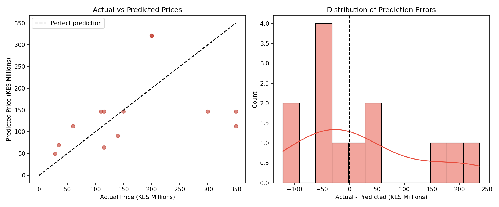
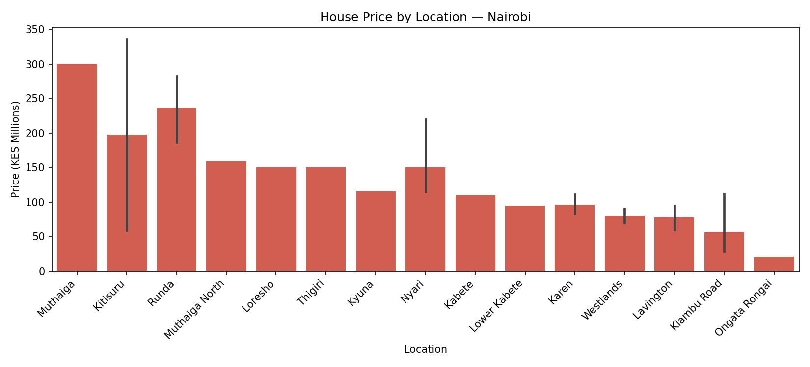
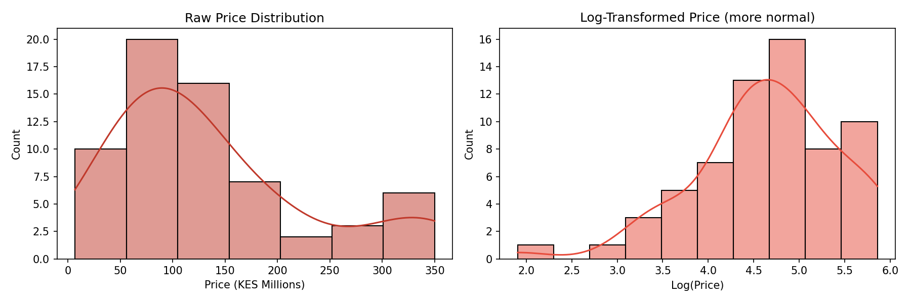

# Nairobi Housing Price Regression 🏠🇰🇪

A multiple linear regression model predicting Nairobi residential 
property prices using location tier, number of bedrooms, and property 
type. Built on real listings data scraped from Nairobi's property market.

---

## Model Performance

| Metric | Value |
|--------|-------|
| Train R-squared | 0.378 |
| Test R-squared  | 0.375 |
| RMSE            | KSh 1.8M |

Train and test R-squared are nearly identical, confirming the model 
generalises well to unseen data with no overfitting.

---

## Key Findings

- **Location is the strongest price driver** — Upmarket neighbourhoods 
  (Muthaiga, Runda, Karen, Kitisuru) command a **137% price premium** 
  over emerging areas like Ongata Rongai and Kabete (coef = 0.865, p = 0.001)

- **Each additional bedroom adds ~27% to price** — a statistically 
  significant effect (coef = 0.235, p = 0.001)

- **Price range** — KSh 6.7M (Ongata Rongai apartments) to KSh 350M 
  (Muthaiga/Runda townhouses)

- **The model predicts mid-range properties well** but underestimates 
  luxury properties above KSh 250M — features like pool, land size, 
  and proximity to CBD would improve this

---

## Charts

### Actual vs Predicted Prices

### House Price by Location

### Price Distribution

---

## Regression Assumptions

| Assumption | Test | Result |
|---|---|---|
| Linearity | Residuals vs Fitted plot | ✅ Random scatter around zero |
| Normality | Q-Q plot + Omnibus test (p=0.767) | ✅ Residuals normally distributed |
| Homoskedasticity | Residual plot | ✅ No fan pattern detected |
| Multicollinearity | Condition Number (27.7) | ✅ Well below 1000 threshold |

---

## Model Limitations

- 63 observations after cleaning — a larger dataset would improve reliability
- Luxury properties (above KSh 250M) are systematically underestimated
- House size column was too sparse (57/63 missing) to include as a feature
- Missing features that would help: land size, pool, age of property, 
  floor number, proximity to CBD

---

## Data Source

Real property listings — Nairobi, Kenya  
Collected from Kaggle: Nairobi Property Prices dataset

---

